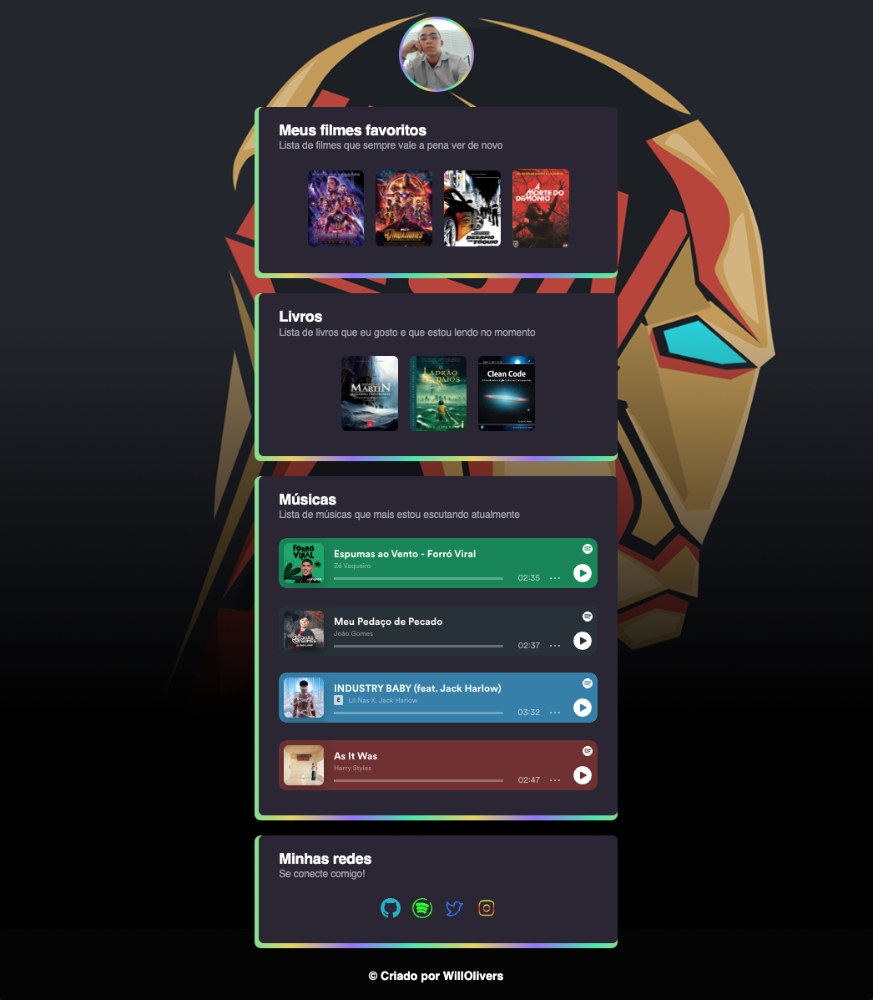

# Personal Library - Project NLW

> Trilha explorer

- Projeto construíto baseado na Next Level Week

## Tecnologias usadas no projeto

 
  
  
   
  

   
   
  
# Sobre o projeto!
Fiz esse projeto como desafio depois de concluir a NLW Esports ( *[ Next Level Week eSports ](https://nextlevelweek.com/)* ) , um projeto da *[ 🚀@Rocketseat ](https://github.com/Rocketseat)* , e dos ensinamentos do educador *[ @Mayk Brito ](https://github.com/maykbrito)*. 
Utilizei o que eu aprendi no curso e um pouco mais que eu ia aprendendo vendo por bibliotecas e trocando experiências pela comunidade, estou ansioso em continuar essa jornada. 

><q>Esse foi meu segundo projeto concluído, e já estou pensando em qual vai ser o próximo projeto.</q>

# Contato
> Contate-me pelo <a href='https://www.linkedin.com/in/willy-oliveira-2542a0208/'>Linkedin<a> 
#

  <h2>🕹️ Prévia do layout do projeto</h2>

   

       
   

> Você pode acessar o <a href='https://willolivers.github.io/Personal-Library/'>Projeto</a> aqui!